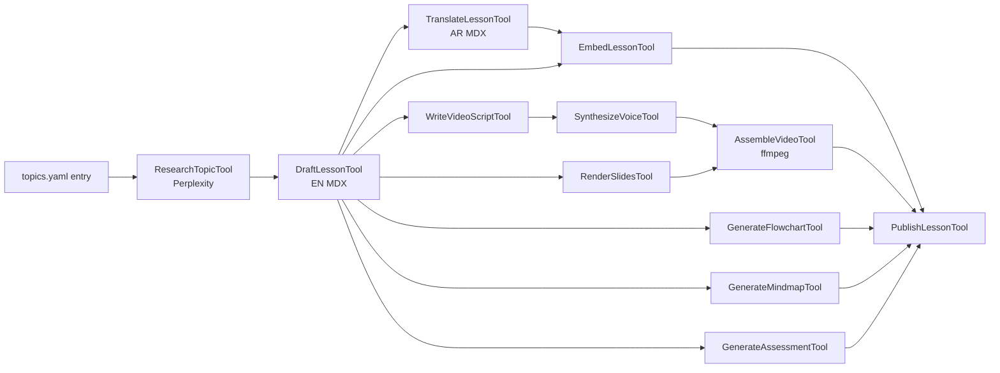

# Curriculum Generation Pipeline

> You give me topics. The pipeline produces, per lesson, in **both EN and AR**:
> 1. Researched text content (MDX)
> 2. Flowchart (Mermaid)
> 3. Mindmap (Mermaid)
> 4. Video (script → TTS → slides → MP4)
> 5. Daily assessment items (MCQ + short answer + scenario)
> 6. Embeddings (for RAG)

The pipeline lives in `apps/api/src/contexts/curriculum/application/generate-lesson/` and is itself an **agent** with tools — same patterns as the student-facing tutor (CLAUDE.md §10).

---

## Inputs

A topic file you drop into `contexts/curriculum/seed/{india,ksa}/topics.yaml`:

```yaml
- track: ksa
  phase: 2
  module: VAT in KSA
  lessons:
    - slug: ksa-vat-place-of-supply
      title:
        en: Place of Supply under KSA VAT
        ar: مكان التوريد بموجب ضريبة القيمة المضافة في المملكة
      learning_objectives:
        - Determine place of supply for goods vs services
        - Apply RCM on imported services
      sources:                       # optional — pipeline researches if missing
        - https://zatca.gov.sa/...
```

That's all you give. The pipeline does the rest.

---

## Pipeline stages

Each stage is a **tool** invoked by the `GenerateLessonAgent` sub-agent. Tools follow the Claude Code per-tool folder convention (CLAUDE.md §4.2).

```
contexts/curriculum/application/generate-lesson/
  generate-lesson.agent.ts       # the sub-agent (orchestrator)
  tools/
    ResearchTopicTool/           # Perplexity → cited facts
    DraftLessonTool/             # Azure OpenAI → MDX content (EN)
    TranslateLessonTool/         # Azure OpenAI → AR translation, RTL-aware
    GenerateFlowchartTool/       # Mermaid flowchart
    GenerateMindmapTool/         # Mermaid mindmap
    WriteVideoScriptTool/        # narration script (EN + AR)
    SynthesizeVoiceTool/         # Azure TTS / ElevenLabs
    RenderSlidesTool/            # MDX slides → PNG via @react-pdf or remotion
    AssembleVideoTool/           # ffmpeg merge slides + voice → MP4
    GenerateAssessmentTool/      # MCQ + short answer + scenario, both locales
    EmbedLessonTool/              # Azure embeddings → pgvector
    PublishLessonTool/           # writes to CurriculumLesson + storage
```

### Stage flow



### Stage contracts

| Tool | Inputs | Outputs |
|---|---|---|
| `ResearchTopicTool` | topic, locale, market | `{ facts: string[]; citations: {url, title}[] }` |
| `DraftLessonTool` | topic, facts, learning_objectives | `{ mdxEn: string; sections: string[] }` |
| `TranslateLessonTool` | mdxEn | `{ mdxAr: string }` |
| `GenerateFlowchartTool` | mdxEn | `{ mermaid: string }` |
| `GenerateMindmapTool` | mdxEn | `{ mermaid: string }` |
| `WriteVideoScriptTool` | mdxEn, mdxAr, target_minutes | `{ scriptEn: Scene[]; scriptAr: Scene[] }` |
| `SynthesizeVoiceTool` | scriptEn, scriptAr | `{ audioEnUrl: string; audioArUrl: string }` |
| `RenderSlidesTool` | mdxEn, mdxAr | `{ slidesEnUrls: string[]; slidesArUrls: string[] }` |
| `AssembleVideoTool` | slides, audio | `{ videoEnUrl: string; videoArUrl: string }` |
| `GenerateAssessmentTool` | mdxEn, mdxAr, blueprint | `{ items: AssessmentItem[] }` (both locales) |
| `EmbedLessonTool` | mdxEn, mdxAr, sections | `{ vectors: number[][] }` (1536-d) |
| `PublishLessonTool` | all of the above | `CurriculumLesson` row + Supabase Storage assets |

All inputs validated by Zod. All tools `checkPermissions` — `PublishLessonTool` requires explicit admin approval.

### Why an agent and not a script

- **Self-correcting:** the agent can re-research if drafts cite weak sources, re-translate if RTL fails QA, re-render if a slide overflows.
- **Tool-resumable:** if the video render fails, only that tool re-runs; everything cached in `lesson_artifacts/`.
- **Plan mode:** before bulk-generating a 30-lesson module, agent enters plan mode → shows the table of generated outputs → admin approves → executes. Mirrors `EnterPlanModeTool` from Claude Code.

---

## Storage layout

```
contexts/curriculum/seed/
  india/
    topics.yaml
    generated/                   # gitignored, regeneratable
      <slug>/
        en.mdx
        ar.mdx
        flowchart.mmd
        mindmap.mmd
        script.en.json
        script.ar.json
        slides/01.png …
        video.en.mp4
        video.ar.mp4
        assessment.json
        embedding.bin
        manifest.json            # tool versions + hashes for cache invalidation
  ksa/
    topics.yaml
    generated/...
```

Final published lessons live in Supabase Storage; DB row in `CurriculumLesson` points to URLs.

---

## Trigger

```bash
# Generate a single lesson
pnpm --filter @sa/api generate:lesson --slug ksa-vat-place-of-supply

# Bulk generate a track in plan mode
pnpm --filter @sa/api generate:track --market ksa --plan
```

These commands invoke the `GenerateLessonAgent` from a CLI entry point in `apps/api/src/cli/`.

---

## What you provide vs what we generate

| You | The pipeline |
|---|---|
| Topic title + learning objectives | Researches sources via Perplexity |
| (optional) authoritative URLs | Falls back to autonomous search if absent |
| Approval in plan mode | Drafts, translates, generates media, embeds, publishes |
| Edits to MDX (post-publish) | Re-runs only affected downstream stages |

You will never write an MDX file by hand unless you want to.
