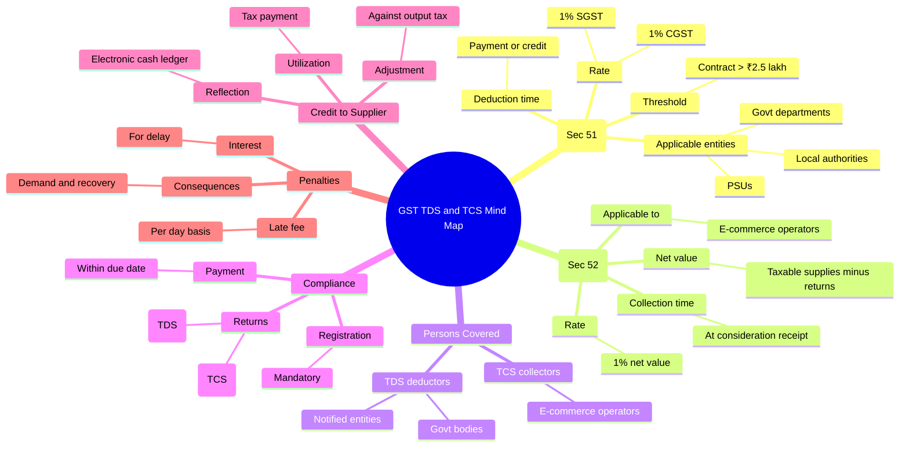
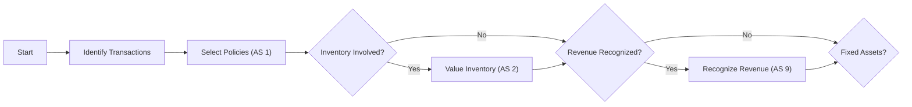
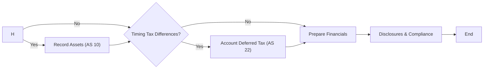
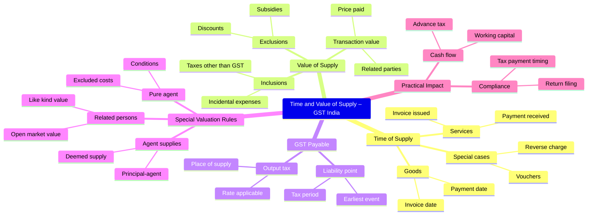
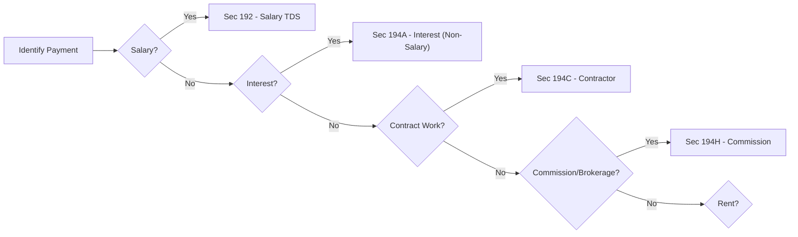
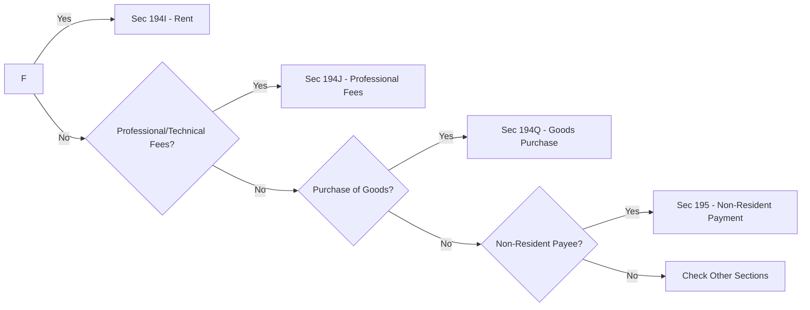
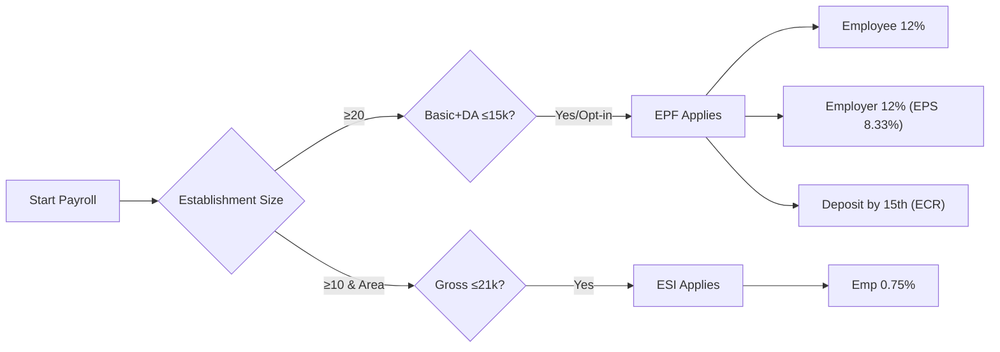
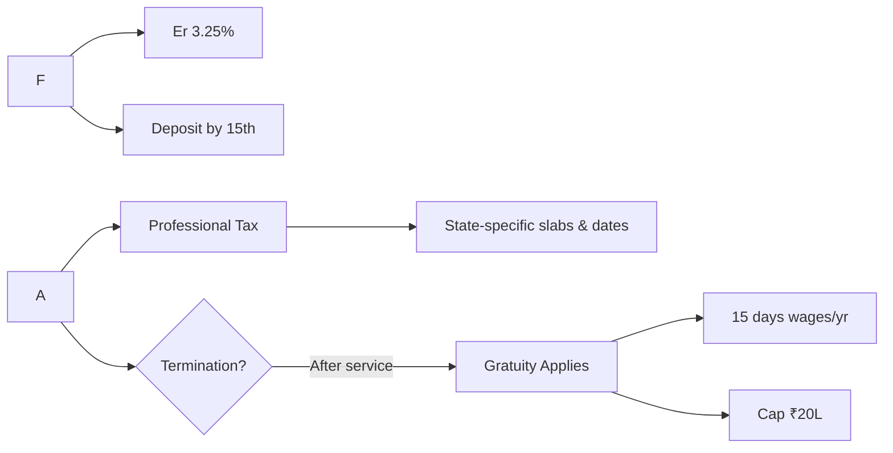
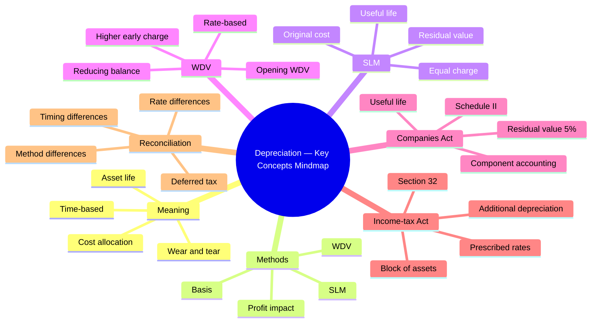
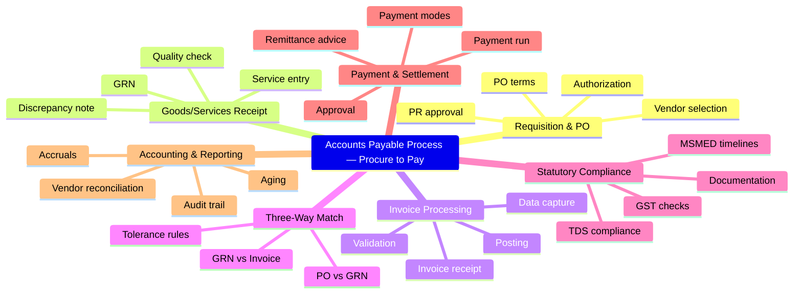

# Lesson Flowchart Audit — 2026-06-02

> Static triage of every Mermaid source attached to a CurriculumLesson.
> Generated by `scripts/audit-flowcharts.mjs`. Re-runnable. No content is mutated.

- **Lessons audited:** 111
- **Mermaid blocks found:** 222
- **Blocks flagged (score ≥ 15):** 35

## Systemic issues (act on these first)

- **Unquoted parentheses inside `[...]` labels** in 16 (7%) of blocks. Mermaid parses inner `(`/`)` as a different node shape, turning labels into garbage. Fix: wrap any `[Label (qualifier)]` body in double-quotes — `["Label (qualifier)"]`.

## Score distribution

| bucket | count |
|---|---|
| 0-5 | 83 |
| 5-10 | 61 |
| 10-20 | 65 |
| 20+ | 13 |

## Chart types in use

| type | count |
|---|---|
| `flowchart` | 111 |
| `mindmap` | 111 |

## Heuristic hits

| heuristic | blocks hit |
|---|---|
| No explicit orientation | 0 |
| Unquoted `(`/`)` in `[...]` | 16 |
| Unquoted special chars (`&%/:—`) | 86 |
| Too many nodes (>12) | 29 |
| Too many lines (>20) | 110 |
| Too many subgraphs (>3) | 0 |
| Unusual chart type | 0 |

## Top 50 worst offenders

Sorted by total score, descending.

| score | lesson slug | titleEn | origin | flags |
|---|---|---|---|---|
| 46.5 | `in-gst-tds-tcs-under-gst` | GST TDS and GST TCS — Sections 51 and 52 | `mindmapMermaid` | `lines=51` |
| 41 | `in-as-key-standards` | The Standards Every Accountant Must Know — AS 1, 2, 9, 10, 22 | `flowchartMermaid` | `nodes=19` `unq-parens=5` `unq-specials=1` |
| 39 | `in-gst-time-and-value-of-supply` | Time of Supply and Value of Supply | `mindmapMermaid` | `lines=46` |
| 39 | `in-tds-key-sections` | Key TDS Sections — 192, 194A, 194C, 194H, 194I, 194J, 194Q, 195 | `flowchartMermaid` | `nodes=19` `unq-parens=1` `unq-specials=10` |
| 38 | `in-payroll-pf-esi-pt` | PF, ESI, Professional Tax, and Gratuity — Rules and Rates | `flowchartMermaid` | `nodes=19` `unq-parens=2` `unq-specials=7` |
| 31 | `in-final-balance-sheet` | Balance Sheet under Schedule III | `flowchartMermaid` | `nodes=14` `unq-parens=3` `unq-specials=6` |
| 26 | `in-tax-house-property` | Income from House Property — Self-Occupied, Let-Out, Deemed Let-Out | `flowchartMermaid` | `nodes=13` `unq-parens=2` `unq-specials=7` |
| 25.5 | `in-adj-depreciation` | Depreciation — Concept, Methods (SLM, WDV) and Companies Act vs IT Act | `mindmapMermaid` | `lines=37` |
| 24 | `in-ap-process` | Accounts Payable Process — Procure to Pay | `mindmapMermaid` | `lines=36` |
| 21 | `in-gst-introduction-and-benefits` | GST — One Nation, One Tax (Why GST Replaced VAT/Excise/Service Tax) | `flowchartMermaid` | `unq-parens=1` `unq-specials=8` |
| 21 | `in-gst-registration` | GST Registration — Who, When, and How (GST Portal Walkthrough) | `mindmapMermaid` | `lines=34` |
| 21 | `in-je-common-entries` | 25 Most Common Journal Entries Every Accountant Sees | `mindmapMermaid` | `lines=34` |
| 20 | `in-gst-imports-and-customs` | Imports under GST — IGST at Customs, Bill of Entry, ITC Recovery | `flowchartMermaid` | `nodes=16` `unq-parens=2` `unq-specials=1` |
| 18 | `in-ar-customer-master` | Customer Master Data and AR Reconciliation | `mindmapMermaid` | `lines=32` |
| 18 | `in-bk-classification-of-accounts` | Classification of Accounts — Personal, Real, Nominal | `flowchartMermaid` | `nodes=14` `unq-specials=7` |
| 18 | `in-brs-introduction` | Why Bank Books and Pass Books Disagree | `mindmapMermaid` | `lines=32` |
| 18 | `in-gst-notices-and-assessments` | GST Notices, Assessments, and the Adjudication Process | `mindmapMermaid` | `lines=32` |
| 18 | `in-gst-returns-gstr3b` | GSTR-3B — The Self-Assessed Monthly Return | `mindmapMermaid` | `lines=32` |
| 18 | `in-payroll-tally-setup` | Payroll in Tally Prime — Employees, Salary Structure, Pay Slips | `mindmapMermaid` | `lines=32` |
| 16.5 | `in-ap-vendor-master-and-recon` | Vendor Master, Vendor Statement Reconciliation, and Risks | `mindmapMermaid` | `lines=31` |
| 16.5 | `in-gst-annual-return-gstr9` | GSTR-9 and GSTR-9C — Annual Return and Reconciliation Statement | `mindmapMermaid` | `lines=31` |
| 16.5 | `in-gst-returns-gstr1` | GSTR-1 — Outward Supplies Return | `mindmapMermaid` | `lines=31` |
| 16.5 | `in-tds-certificates-and-returns` | TDS Certificates (Form 16, 16A) and Returns (24Q, 26Q, 27Q) | `mindmapMermaid` | `lines=31` |
| 16 | `in-adj-accrued-income-expense` | Accrued Income and Accrued Expenses | `flowchartMermaid` | `unq-specials=8` |
| 16 | `in-inv-what-is-inventory` | What Counts as Inventory — Raw Materials, WIP, Finished Goods | `flowchartMermaid` | `unq-specials=8` |
| 16 | `in-tally-accounting-vouchers` | Accounting Vouchers in Tally — F4 to F9 Walkthrough | `flowchartMermaid` | `unq-specials=8` |
| 16 | `in-tax-advance-tax` | Advance Tax — Instalments, Interest u/s 234B/C | `flowchartMermaid` | `unq-specials=8` |
| 15 | `in-adj-depreciation` | Depreciation — Concept, Methods (SLM, WDV) and Companies Act vs IT Act | `flowchartMermaid` | `nodes=14` `unq-parens=1` `unq-specials=3` |
| 15 | `in-final-pl-statement` | Statement of Profit and Loss under Schedule III | `flowchartMermaid` | `unq-parens=1` `unq-specials=5` |
| 15 | `in-gst-composition-scheme` | Composition Scheme — When and Why a Small Business Opts In | `mindmapMermaid` | `lines=30` |
| 15 | `in-gst-export-and-lut` | Exports under GST — Zero-Rated Supply, LUT, and Refund of Unutilised ITC | `mindmapMermaid` | `lines=30` |
| 15 | `in-ratio-liquidity-solvency` | Liquidity and Solvency Ratios | `mindmapMermaid` | `lines=30` |
| 15 | `in-tax-house-property` | Income from House Property — Self-Occupied, Let-Out, Deemed Let-Out | `mindmapMermaid` | `lines=30` |
| 15 | `in-tax-other-sources` | Income from Other Sources | `mindmapMermaid` | `lines=30` |
| 15 | `in-voucher-source-documents` | Source Documents — Invoices, Receipts, Bills, Contracts | `flowchartMermaid` | `unq-parens=1` `unq-specials=5` |

## Top 10 — detailed breakdown

### 1. `in-gst-tds-tcs-under-gst` — GST TDS and GST TCS — Sections 51 and 52

- **Track:** —  ·  **Module:** GST End-to-End  ·  **Origin:** `mindmapMermaid`
- **Score:** 46.5
- **Flags:** `lines=51`

**Score breakdown:**

| heuristic | points |
|---|---|
| lineCount | 46.5 |

**Source:**



**Why it's flagged:**

51 non-blank source lines is well past the "single screen of source" rule; long sources correlate strongly with diagrams the LLM intended to be a checklist, not a chart.

**Suggested rewrite:**

```mermaid
flowchart LR
mindmap
root((GST TDS and TCS Mind Map))
GST TDS (Sec 51)
Applicable entities
Govt departments
Local authorities
PSUs
Rate
1% CGST
1% SGST
Threshold
Contract > ₹2.5 lakh
Deduction time
Payment or credit
GST TCS (Sec 52)
Applicable to
E-commerce operators
Rate
1% net value
Collection time
At consideration receipt
Net value
Taxable supplies minus returns
Persons Covered
TDS deductors
Govt bodies
Notified entities
TCS collectors
E-commerce operators
Compliance
Registration
Mandatory
Returns
GSTR-7 (TDS)
GSTR-8 (TCS)
Payment
Within due date
Credit to Supplier
Reflection
Electronic cash ledger
Utilization
Tax payment
Adjustment
Against output tax
Penalties
Late fee
Per day basis
Interest
For delay
Consequences
Demand and recovery
```

---

### 2. `in-as-key-standards` — The Standards Every Accountant Must Know — AS 1, 2, 9, 10, 22

- **Track:** —  ·  **Module:** Accounting Standards (India)  ·  **Origin:** `flowchartMermaid`
- **Score:** 41
- **Flags:** `nodes=19` `unq-parens=5` `unq-specials=1`

**Score breakdown:**

| heuristic | points |
|---|---|
| nodeCount | 14 |
| unquotedParensInSquares | 25 |
| unquotedSpecialChars | 2 |

**Source:**

```mermaid
flowchart LR
A[Start] --> B[Identify Transactions]
B --> C[Select Policies (AS 1)]
C --> D{Inventory Involved?}
D -- Yes --> E[Value Inventory (AS 2)]
D -- No --> F{Revenue Recognized?}
E --> F
F -- Yes --> G[Recognize Revenue (AS 9)]
F -- No --> H{Fixed Assets?}
G --> H
H -- Yes --> I[Record Assets (AS 10)]
H -- No --> J{Timing Tax Differences?}
I --> J
J -- Yes --> K[Account Deferred Tax (AS 22)]
J -- No --> L[Prepare Financials]
K --> L
L --> M[Disclosures & Compliance]
M --> N[End]
```

**Why it's flagged:**

19 distinct nodes in a single diagram exceeds the readability threshold (~12). At this density the renderer either overflows the viewport or compresses the layout until labels collide — both of which match the strategy-review complaint that flowcharts are "messy and cluttered". 5 `[label (qualifier)]` pattern(s) with bare parens — mermaid parses the inner `(` as a different shape and the rendered label fragments. The runtime sanitiser catches some of these but not all positions. 1 unquoted special character(s) (one of `& % / : — –`) inside label bodies — these either break the parser or get HTML-escaped into noise.

**Suggested rewrite:**





---

### 3. `in-gst-time-and-value-of-supply` — Time of Supply and Value of Supply

- **Track:** —  ·  **Module:** GST End-to-End  ·  **Origin:** `mindmapMermaid`
- **Score:** 39
- **Flags:** `lines=46`

**Score breakdown:**

| heuristic | points |
|---|---|
| lineCount | 39 |

**Source:**



**Why it's flagged:**

46 non-blank source lines is well past the "single screen of source" rule; long sources correlate strongly with diagrams the LLM intended to be a checklist, not a chart.

**Suggested rewrite:**

```mermaid
flowchart LR
mindmap
Time and Value of Supply – GST India
Time of Supply
Goods
Invoice date
Payment date
Services
Invoice issued
Payment received
Special cases
Reverse charge
Vouchers
Value of Supply
Transaction value
Price paid
Related parties
Inclusions
Taxes other than GST
Incidental expenses
Exclusions
Discounts
Subsidies
GST Payable
Output tax
Rate applicable
Place of supply
Liability point
Earliest event
Tax period
Special Valuation Rules
Related persons
Open market value
Like kind value
Agent supplies
Principal-agent
Deemed supply
Pure agent
Excluded costs
Conditions
Practical Impact
Compliance
Return filing
Tax payment timing
Cash flow
Advance tax
Working capital
```

---

### 4. `in-tds-key-sections` — Key TDS Sections — 192, 194A, 194C, 194H, 194I, 194J, 194Q, 195

- **Track:** —  ·  **Module:** TDS (Tax Deducted at Source)  ·  **Origin:** `flowchartMermaid`
- **Score:** 39
- **Flags:** `nodes=19` `unq-parens=1` `unq-specials=10`

**Score breakdown:**

| heuristic | points |
|---|---|
| nodeCount | 14 |
| unquotedParensInSquares | 5 |
| unquotedSpecialChars | 20 |

**Source:**

```mermaid
flowchart LR
A[Identify Payment] --> B{Salary?}
B -->|Yes| S192[Sec 192<br/>Salary TDS]
B -->|No| C{Interest?}
C -->|Yes| S194A[Sec 194A<br/>Interest (Non-Salary)]
C -->|No| D{Contract Work?}
D -->|Yes| S194C[Sec 194C<br/>Contractor]
D -->|No| E{Commission/Brokerage?}
E -->|Yes| S194H[Sec 194H<br/>Commission]
E -->|No| F{Rent?}
F -->|Yes| S194I[Sec 194I<br/>Rent]
F -->|No| G{Professional/Technical Fees?}
G -->|Yes| S194J[Sec 194J<br/>Professional Fees]
G -->|No| H{Purchase of Goods?}
H -->|Yes| S194Q[Sec 194Q<br/>Goods Purchase]
H -->|No| I{Non-Resident Payee?}
I -->|Yes| S195[Sec 195<br/>Non-Resident Payment]
I -->|No| Z[Check Other Sections]
```

**Why it's flagged:**

19 distinct nodes in a single diagram exceeds the readability threshold (~12). At this density the renderer either overflows the viewport or compresses the layout until labels collide — both of which match the strategy-review complaint that flowcharts are "messy and cluttered". 1 `[label (qualifier)]` pattern(s) with bare parens — mermaid parses the inner `(` as a different shape and the rendered label fragments. The runtime sanitiser catches some of these but not all positions. 10 unquoted special character(s) (one of `& % / : — –`) inside label bodies — these either break the parser or get HTML-escaped into noise.

**Suggested rewrite:**





---

### 5. `in-payroll-pf-esi-pt` — PF, ESI, Professional Tax, and Gratuity — Rules and Rates

- **Track:** —  ·  **Module:** Payroll  ·  **Origin:** `flowchartMermaid`
- **Score:** 38
- **Flags:** `nodes=19` `unq-parens=2` `unq-specials=7`

**Score breakdown:**

| heuristic | points |
|---|---|
| nodeCount | 14 |
| unquotedParensInSquares | 10 |
| unquotedSpecialChars | 14 |

**Source:**

```mermaid
flowchart LR
A[Start Payroll] --> B{Establishment Size}
B -->|≥20| C{Basic+DA ≤15k?}
C -->|Yes/Opt-in| D[EPF Applies]
D --> D1[Employee 12%]
D --> D2[Employer 12% (EPS 8.33%)]
D --> D3[Deposit by 15th (ECR)]
B -->|≥10 & Area| E{Gross ≤21k?}
E -->|Yes| F[ESI Applies]
F --> F1[Emp 0.75%]
F --> F2[Er 3.25%]
F --> F3[Deposit by 15th]
A --> G[Professional Tax]
G --> G1[State-specific slabs & dates]
A --> H{Termination?}
H -->|After service| I[Gratuity Applies]
I --> I1[15 days wages/yr]
I --> I2[Cap ₹20L]
```

**Why it's flagged:**

19 distinct nodes in a single diagram exceeds the readability threshold (~12). At this density the renderer either overflows the viewport or compresses the layout until labels collide — both of which match the strategy-review complaint that flowcharts are "messy and cluttered". 2 `[label (qualifier)]` pattern(s) with bare parens — mermaid parses the inner `(` as a different shape and the rendered label fragments. The runtime sanitiser catches some of these but not all positions. 7 unquoted special character(s) (one of `& % / : — –`) inside label bodies — these either break the parser or get HTML-escaped into noise.

**Suggested rewrite:**





---

### 6. `in-final-balance-sheet` — Balance Sheet under Schedule III

- **Track:** —  ·  **Module:** Final Accounts and Schedule III  ·  **Origin:** `flowchartMermaid`
- **Score:** 31
- **Flags:** `nodes=14` `unq-parens=3` `unq-specials=6`

**Score breakdown:**

| heuristic | points |
|---|---|
| nodeCount | 4 |
| unquotedParensInSquares | 15 |
| unquotedSpecialChars | 12 |

**Source:**

```mermaid
flowchart LR
A[Companies Act 2013] --> B[Schedule III Framework]
B --> C[Prepare Balance Sheet]
C --> D[Equity & Liabilities]
C --> E[Assets]

D --> F[Shareholders' Funds]
F --> G[Share Capital]
F --> H[Reserves & Surplus<br/>(Debit shown negative)]

D --> I[Liabilities]
I --> J[Non-current Liab]
I --> K[Current Liab<br/>(MSME disclosure)]

E --> L[Non-current Assets]
E --> M[Current Assets]

C --> N[Contingent Liab & Commitments<br/>(Notes)]
```

**Why it's flagged:**

14 distinct nodes in a single diagram exceeds the readability threshold (~12). At this density the renderer either overflows the viewport or compresses the layout until labels collide — both of which match the strategy-review complaint that flowcharts are "messy and cluttered". 3 `[label (qualifier)]` pattern(s) with bare parens — mermaid parses the inner `(` as a different shape and the rendered label fragments. The runtime sanitiser catches some of these but not all positions. 6 unquoted special character(s) (one of `& % / : — –`) inside label bodies — these either break the parser or get HTML-escaped into noise.

**Suggested fix:** quote every `[Label (qualifier)]` body; split into 2 smaller charts; wrap special-char labels in `"..."`.

---

### 7. `in-tax-house-property` — Income from House Property — Self-Occupied, Let-Out, Deemed Let-Out

- **Track:** —  ·  **Module:** Indian Taxation Foundations  ·  **Origin:** `flowchartMermaid`
- **Score:** 26
- **Flags:** `nodes=13` `unq-parens=2` `unq-specials=7`

**Score breakdown:**

| heuristic | points |
|---|---|
| nodeCount | 2 |
| unquotedParensInSquares | 10 |
| unquotedSpecialChars | 14 |

**Source:**

```mermaid
flowchart LR
A[Start: House Property] --> B{Section 22 Conditions Met?}
B -->|Yes| C{Property Type}
B -->|No| Z[Not Taxable]

C --> D[Self-Occupied]
C --> E[Let-Out]
C --> F[Deemed Let-Out]

D --> G[Annual Value = Nil<br/>Sec 23(2)]
E --> H[Compute Annual Value<br/>Sec 23(1)]
F --> H

G --> I[Deductions Sec 24]
H --> I

I --> J[Interest on Loan<br/>Std Deduction 30%]

J --> K[Compute Income / Loss]
K --> L[Set-off & Carry Forward]
```

**Why it's flagged:**

13 distinct nodes in a single diagram exceeds the readability threshold (~12). At this density the renderer either overflows the viewport or compresses the layout until labels collide — both of which match the strategy-review complaint that flowcharts are "messy and cluttered". 2 `[label (qualifier)]` pattern(s) with bare parens — mermaid parses the inner `(` as a different shape and the rendered label fragments. The runtime sanitiser catches some of these but not all positions. 7 unquoted special character(s) (one of `& % / : — –`) inside label bodies — these either break the parser or get HTML-escaped into noise.

**Suggested fix:** quote every `[Label (qualifier)]` body; split into 2 smaller charts; wrap special-char labels in `"..."`.

---

### 8. `in-adj-depreciation` — Depreciation — Concept, Methods (SLM, WDV) and Companies Act vs IT Act

- **Track:** —  ·  **Module:** Adjusting Entries  ·  **Origin:** `mindmapMermaid`
- **Score:** 25.5
- **Flags:** `lines=37`

**Score breakdown:**

| heuristic | points |
|---|---|
| lineCount | 25.5 |

**Source:**



**Why it's flagged:**

37 non-blank source lines is well past the "single screen of source" rule; long sources correlate strongly with diagrams the LLM intended to be a checklist, not a chart.

**Suggested fix:** manual cleanup required.

---

### 9. `in-ap-process` — Accounts Payable Process — Procure to Pay

- **Track:** —  ·  **Module:** Accounts Receivable and Payable  ·  **Origin:** `mindmapMermaid`
- **Score:** 24
- **Flags:** `lines=36`

**Score breakdown:**

| heuristic | points |
|---|---|
| lineCount | 24 |

**Source:**



**Why it's flagged:**

36 non-blank source lines is well past the "single screen of source" rule; long sources correlate strongly with diagrams the LLM intended to be a checklist, not a chart.

**Suggested fix:** manual cleanup required.

---

### 10. `in-gst-introduction-and-benefits` — GST — One Nation, One Tax (Why GST Replaced VAT/Excise/Service Tax)

- **Track:** —  ·  **Module:** GST End-to-End  ·  **Origin:** `flowchartMermaid`
- **Score:** 21
- **Flags:** `unq-parens=1` `unq-specials=8`

**Score breakdown:**

| heuristic | points |
|---|---|
| unquotedParensInSquares | 5 |
| unquotedSpecialChars | 16 |

**Source:**

```mermaid
flowchart LR
A[Multiple Indirect Taxes<br/>(VAT, Excise, Service Tax)] --> B[Problems<br/>Cascading, Complexity]
B --> C[GST Introduced<br/>1 July 2017]

C --> D[Unified Tax System]
C --> E[Input Tax Credit]
C --> F[Dual Taxing Powers]
C --> G[Digital Compliance]

C --> H[Dual GST Model]
H --> I[CGST<br/>Central Govt]
H --> J[SGST / UTGST<br/>State / UT Govt]
H --> K[IGST<br/>Inter-State Supply]
```

**Why it's flagged:**

1 `[label (qualifier)]` pattern(s) with bare parens — mermaid parses the inner `(` as a different shape and the rendered label fragments. The runtime sanitiser catches some of these but not all positions. 8 unquoted special character(s) (one of `& % / : — –`) inside label bodies — these either break the parser or get HTML-escaped into noise.

**Suggested fix:** quote every `[Label (qualifier)]` body; wrap special-char labels in `"..."`.

---

## Method

Score = sum of:

- `(nodeCount − 12) × 2` if nodeCount > 12 (clutter starts ~12 nodes)
- `(lineCount − 20) × 1.5` if lineCount > 20
- `unquoted ( ) in [ ] labels × 5` (very likely render breakage)
- `unquoted &, %, /, :, em-dashes × 2`
- `(subgraphCount − 3) × 4` if subgraphCount > 3
- `+3` if no explicit `flowchart LR/TD/...` orientation
- `+5` if the diagram is `sequenceDiagram`/`gantt`/`classDiagram`

Blocks scoring **≥ 15** are flagged. The renderer (`apps/web/src/components/lesson/mermaid-block.tsx`) sanitises some of these at render time, but content-level fixes are still required to communicate the curriculum cleanly.
